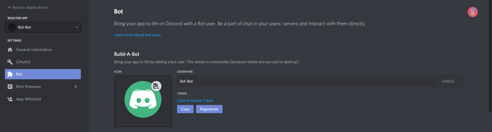
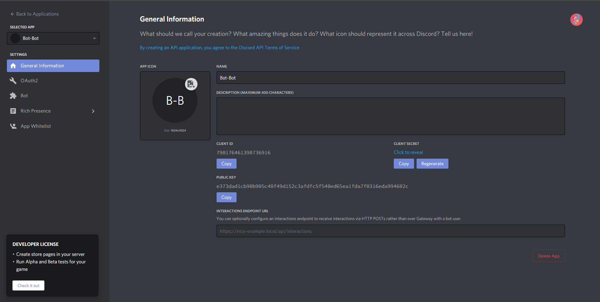
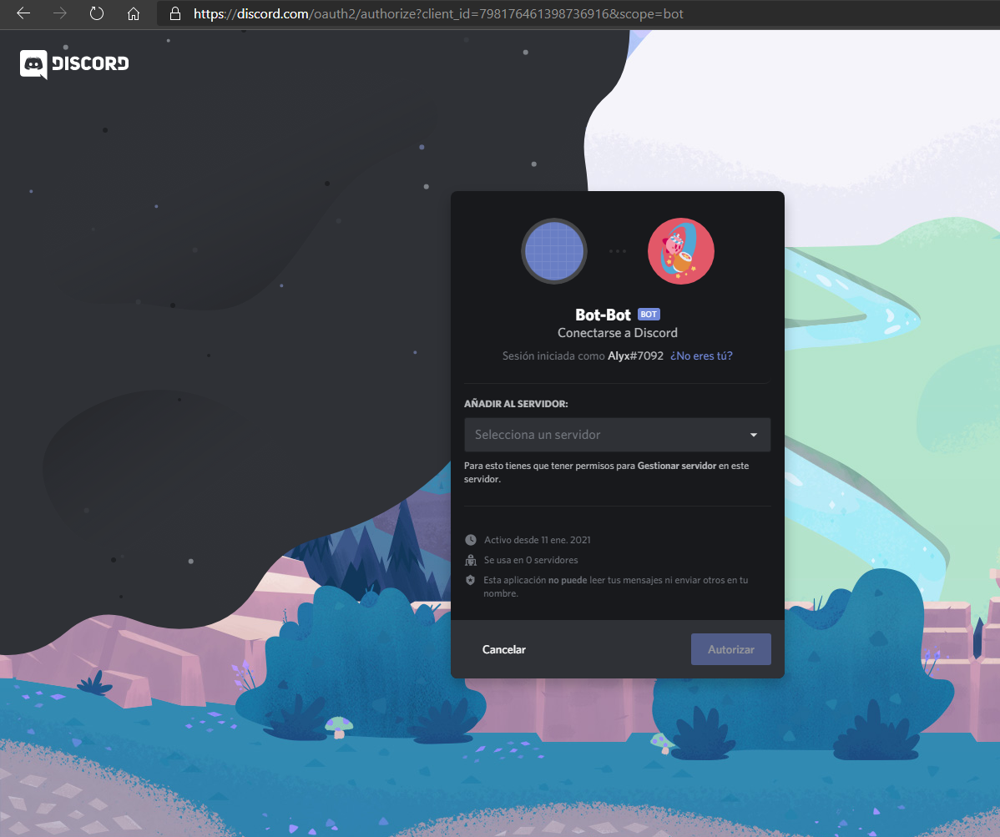
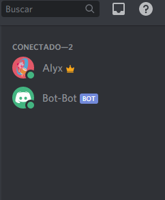

# Coding the bot

For this, we need to create a folder for our code

1. Create a folder, then open a terminal and navigate there
```shell
$ cd path/to/folder
```

2. Then, install discord.js npm library into your project
```shell
$ npm install discord.js
```

3. Create an index.js file on your folder
```shell
touch index.js
```
(Or you can use any file explorer app)

4. Open the file in your favorite code editor

## Starting coding

First of all, we need to import the library into our script, for this:
```js
const Discord = require('discord.js');
```

Then, we create a client:
```js
const client = new Discord.Client();
```

Now, we need to listen when the bot is ready, this an event:
```js
client.once('ready', () => {
    console.log('Ready!');
})
```

Then, we login with the bot's token:
```js
client.login('your-token-goes-here');
```

But what's a token, a token is a string, that allows to access the bot from the code, you find it in the bot section of your app in Discord Developer Portal:



Click the copy button in the token, then paste it in `client.login('token')`

So, if you created a server, let's add the bot to that server, for that we use an bot invitation link
```
https://discord.com/oauth2/authorize?client_id={clientID}&scope=bot
```

You have to replace the clientID part with your bot's client ID, which can be found in the main page of your application in Discord Developer Portal



Find and copy the CLIENT ID in that page    
Then replace the `{clientID}` part in the above link, and open the link

It will show you something like this:



Select the server that you want to add your bot in the dropdown, and click "Authorize"  
It will ask you for a captcha, complete it  
Then go to your server, and you will find the bot in the right hand section     
Now, go to your terminal and start the bot: 
```shell
$ node index.js
```

I recommend using "Nodemon" a npm library that "nodes" the app everytime there's a change, for that:
```shell
$ npm install nodemon -g
```

So, after you see in the console the "Ready!" message, it means that our bot is ready   
You should see your bot online



(Alyx is you, and "Bot-Bot" represents your bot)

## Hooray!

🎉 Congrats!

You now have a bot up & running

## Next Up: [Listening for messages](./Listening.md)