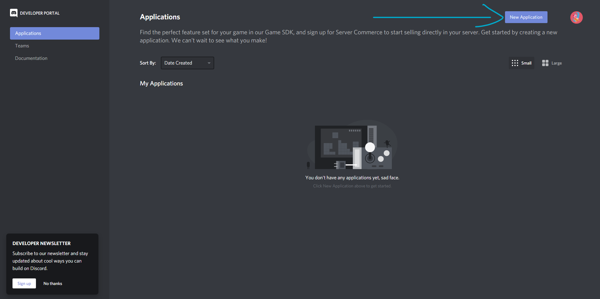
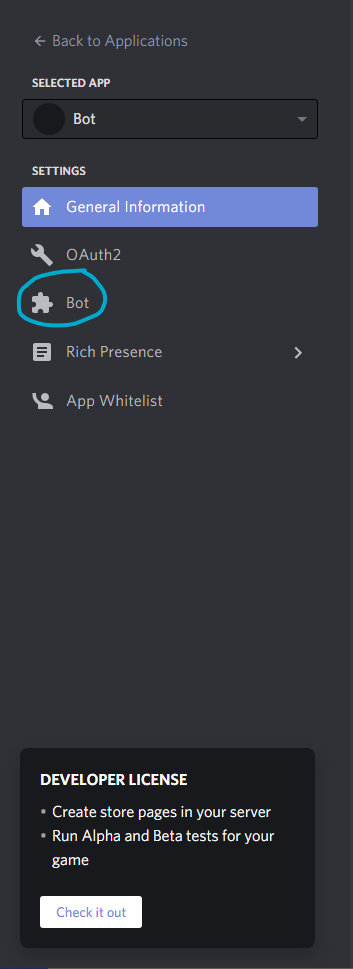
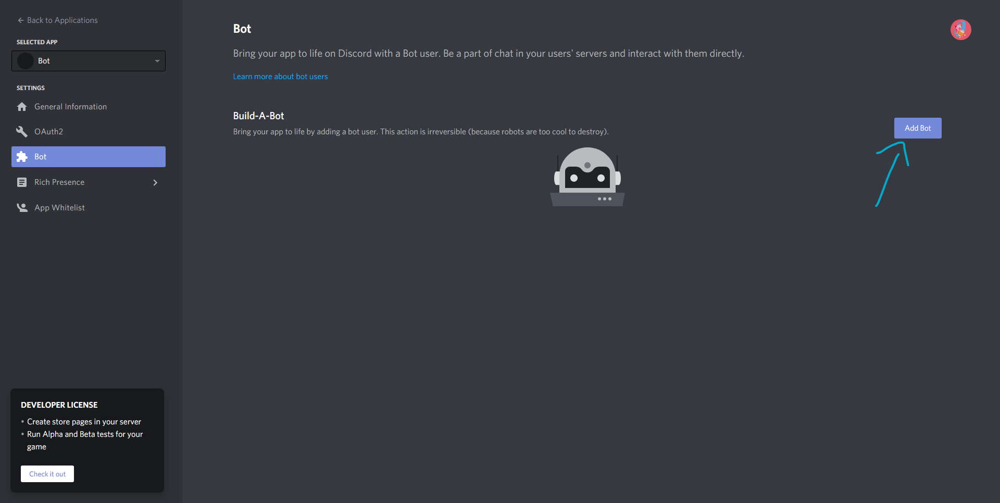

# Starting out making your Discord Bot

First of all, you will need 3 things

1. A basic knowledge of JS (Because we will be using JS for this bot)
2. A [Discord](https://discord.com/register) account
3. NPM and NODE installed, LTS version or latest
4. A [Discord Server](https://support.discord.com/hc/en-us/articles/204849977-How-do-I-create-a-server) for testing the bot **(OPTIONAL)**

That's it.

## Creating the bot in Discord

For start coding the bot, we need to create the bot in Discord

1. Go to [Discord Developer Portal](https://discord.com/developers) and sign in if it's requested
2. Click the top right button that say "New Application"

    It will open the bot settings page

3. Then, go to "Bot" section and click the button that says "Add a bot"

    It will create the bot
4. Hooray! You now have a bot created on Discord

### Next Article: [Coding the bot](./Coding.md)